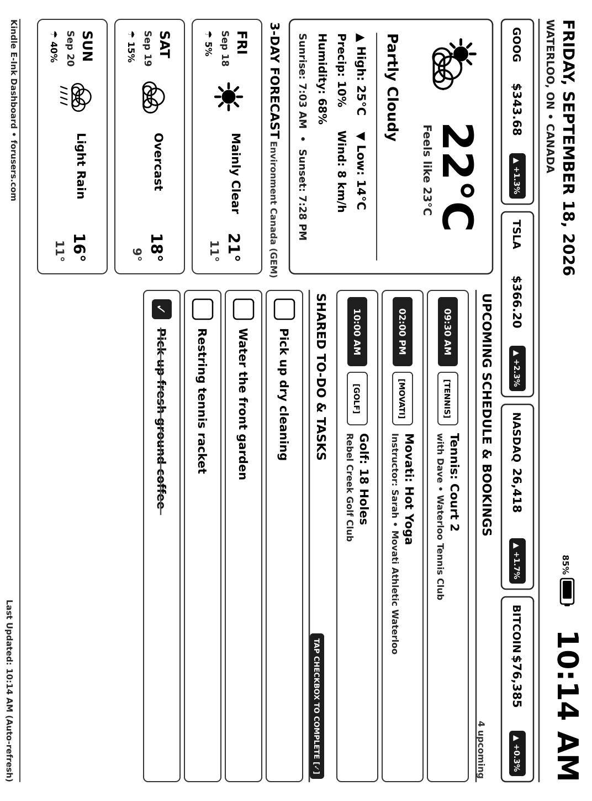

# Kindle E-Ink Weather, Markets & Calendar Dashboard

Transform an Amazon Kindle Paperwhite (tested on Paperwhite 3, 7th Gen) into a dedicated, high-contrast, always-on e-ink dashboard displaying Canadian weather, live financial market tickers, and upcoming calendar bookings.



---

## Features

* **High-Contrast E-Ink Design:** Custom pure black (`#000000`) typography, bold TrueType fonts, and thick outlines designed specifically for maximum legibility in ambient room light without backlighting.
* **Live Financial Market Tickers:** Real-time prices and daily percentage changes for:
  * **GOOG** (Alphabet)
  * **TSLA** (Tesla)
  * **NASDAQ** (^IXIC Composite)
  * **BITCOIN** (BTC-USD)
* **Canadian Weather (Waterloo, ON):**
  * Environment Canada GEM seamless forecast model (via Open-Meteo with `wttr.in` failover).
  * Current temperature, feels like, condition, daily high/low, rain probability, wind speed, humidity, and sunrise/sunset times.
  * 3-day forecast with vector weather icons.
* **Upcoming Schedule & Bookings:**
  * Court bookings (Tennis, Movati, Golf), Google Calendar events, and local KW/Stratford events.
* **Smart Auto-Backlight (Frontlight):**
  * **Plugged in (Wall charger or USB):** Frontlight automatically turns **ON** to a clean, bright intensity (level `14` of 24).
  * **On battery:** Frontlight turns completely **OFF** (level `0`) to maximize battery life.
  * **Instant hardware switching:** An active power event monitor (`lipc-wait-event`) listens for charger plug/unplug events and toggles the light immediately.
* **Landscape Orientation:** Formatted with `ROTATION=90` so the USB power port is positioned on the **right-hand side**.
* **Kiosk / Always-On Mode:** Suppresses Amazon's screensaver (`preventScreenSaver 1`) and reader UI status bar overlays.

---

## Architecture

```
┌────────────────────────────────────────────────────────┐
│               Go Backend (forusers.com)                │
│  - Environment Canada GEM Model (Open-Meteo)           │
│  - Yahoo Finance & CoinGecko APIs                      │
│  - Datastore Bookings & Google Calendar                │
│  - 2D Canvas Renderer (fogleman/gg) + DejaVuSans-Bold  │
│  - Endpoint: /kindle/dashboard.png?rotate=90           │
└───────────────────────────┬────────────────────────────┘
                            │ HTTPS GET (every 15 min)
┌───────────────────────────▼────────────────────────────┐
│              Kindle Paperwhite 3 Client                │
│  - KUAL Extension (/mnt/us/extensions/dashboard/)       │
│  - Control Script (/mnt/us/dashboard/dashboard.sh)     │
│  - Hardware Framebuffer Renderer (FBInk)               │
│  - LIPC Power Daemon (Battery, Backlight, Sleep)       │
└────────────────────────────────────────────────────────┘
```

The server backend is written in pure Go and runs on Google App Engine (serving endpoints at `https://www.forusers.com/kindle`). This repository contains the Kindle client daemon, KUAL extension, configuration, and setup utilities.

---

## Directory Structure

```
.
├── dashboard/
│   ├── config.cfg           # Device settings (rotation, interval, backlight)
│   └── dashboard.sh         # Daemon, refresh loop, FBInk renderer, backlight monitor
├── extensions/
│   └── dashboard/
│       ├── config.xml       # KUAL extension manifest
│       ├── menu.json        # KUAL touch menu entries
│       └── bin/
│           └── dashboard.sh # Extension entry point (symlink/copy of dashboard.sh)
├── install_to_kindle.sh     # One-step USB deployment script
├── test_landscape_90.png    # Pre-rendered 1072x1448 test image (USB on right)
└── README.md
```

---

## Prerequisites

1. **Jailbroken Kindle:** Tested on Paperwhite 3 (7th Gen, serial `G090G1`, FW 5.13.7) jailbroken via `WatchThis`.
2. **KUAL (Kindle Unified Application Launcher):** Installed in your Kindle library.
3. **FBInk:** A copy of the standalone `fbink` binary with image decoding support placed at `/mnt/us/dashboard/fbink` (automatically sourced from `/mnt/us/usbnet/bin/fbink` if USBNetwork is installed).

---

## Installation to Kindle

1. Connect your Kindle to your computer via USB.
2. Run the automated installer:
   ```bash
   ./install_to_kindle.sh
   ```
   This script will:
   - Detect and mount the Kindle partition (`/media/$USER/Kindle`).
   - Copy `dashboard/` and `extensions/` to `/mnt/us/`.
   - Set executable permissions.
   - Sync disk cache and safely unmount the device.

3. Disconnect the USB cable.
4. On your Kindle, open **KUAL** from your library.
5. Tap **Weather Dashboard** -> **Start Dashboard (Auto)**.

---

## Configuration Reference (`config.cfg`)

Edit `dashboard/config.cfg` on the Kindle to customize behavior:

```bash
# Server endpoint
SERVER_URL="https://www.forusers.com"

# Refresh interval in seconds (900 = 15 minutes, 1800 = 30 minutes, 3600 = 1 hour)
REFRESH_INTERVAL=900

# Screen rotation:
# 90  = Landscape with USB port on the RIGHT (default)
# 270 = Landscape with USB port on the LEFT
# 0   = Native portrait mode
ROTATION=90

# Keep screen awake continuously (1 = yes, 0 = allow sleep)
PREVENT_SLEEP=1

# Auto-backlight management:
# 1 = Frontlight ON when plugged in, OFF on battery
# 0 = Manual backlight control
AUTO_BACKLIGHT=1

# Frontlight brightness level when plugged in (0 to 24, default: 14)
BACKLIGHT_PLUGGED_INTENSITY=14
```

---

## How to Update

### 1. Updating the Server Backend
Server-side changes (layout, weather feeds, market tickers, calendar sources) are managed in the `forusers.com` repository:
```bash
cd ~/20p/forusers.com

# Run test suite
go test ./...

# Deploy to Google App Engine
./deploy.sh
```
Once deployed, the Kindle will automatically display the new updates on its next 15-minute refresh cycle—no need to touch the Kindle!

### 2. Updating the Kindle Client via USB
If you make changes to `dashboard.sh` or `config.cfg`:
```bash
cd ~/20p/eink
./install_to_kindle.sh
```

### 3. Updating the Kindle Client via SSH (WiFi / USBNetwork)
If USBNetwork is running and SSH is enabled on your Kindle:
```bash
# Copy updated script over WiFi
scp dashboard/dashboard.sh root@<kindle-ip>:/mnt/us/dashboard/dashboard.sh
scp dashboard/config.cfg root@<kindle-ip>:/mnt/us/dashboard/config.cfg

# Restart dashboard daemon
ssh root@<kindle-ip> "/mnt/us/dashboard/dashboard.sh restart"
```

---

## Operating the Dashboard

* **Start Dashboard (Auto):** Starts the background daemon, fetches the latest dashboard immediately, and refreshes every 15 minutes.
* **Refresh Now:** Triggers a single fetch and screen refresh immediately.
* **Test Screen (Local Image):** Renders the local `test.png` without network access to verify alignment and contrast.
* **Stop Dashboard:** Terminates the background refresh loop and resets power management.
* **Exit / Return to E-Reader Mode:** Press and hold the power button for **15 seconds** until the Kindle screen flashes and restarts to the normal Amazon reader interface.

---

## License

MIT
